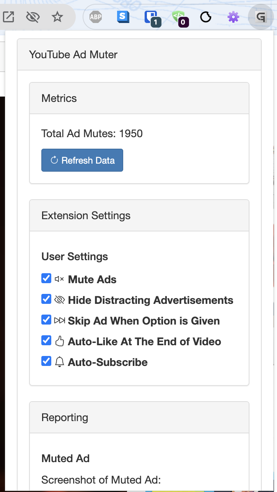

# YouTube Ad Muter

YouTube Ad Muter: The ultimate sidekick for your YouTube binge sessions. This Chrome extension is like your personal hype man, but for silence. It ninja-mutes those pesky ads and pulls off sick skips whenever it can. Say goodbye to your viewing vibe getting killed by random shout-outs for stuff you don't need. It's not just an extension, it's your ticket to peak YouTube chill. Elevate your streaming game and keep those good vibes rolling, fam!



## Features

- Mute YouTube ads like a ninja – say goodbye to earworm jingles!
- Skip ads faster than you can say "FOMO" (when possible, of course)
- Bye Felicia to those pesky banner ads – keep your eyes on the prize
- Auto-smash that like button – because ain't nobody got time for that
- "Watch Later" on steroids – adds vids to your queue faster than you can decide what's for dinner
- Marie Kondo your "Watch Later" list – auto-removes vids that don't spark joy (or have less than 10 seconds left)
- YouTube viewing experience? We just put it in beast mode
- Keeps the YouTube algorithm happy – no ad blocking, just smooth sailing
- Premium vibes without the premium price tag – open-source ftw!
- The only extension that's cracked the YouTube code – helping creators go viral while you binge in peace
- Sneak Peek at the Silenced: Our extension just leveled up, fam! Now it's not just muting ads, it's serving up the tea on what you missed. Every time it drops the mute hammer on an ad, it snaps a pic faster than you can say "screenshot". Head to the all-new reporting zone to peep the gallery of cringe we've saved your ears from. It's like a museum of "almost gotchas" - you get to see all the ads that tried to crash your vibe, but couldn't. Talk about receipts! Now you can literally see how much peace and quiet we're serving up. It's not just ad muting anymore, it's a whole silent disco up in here!


## Installation

1. **Clone the repository:**
	```sh
	git clone https://github.com/purewebdev/youtube-ad-muter.git
	```

2. **Load the extension in Chrome:**
	1. Open Chrome and navigate to `chrome://extensions/`.
	2. Enable "Developer mode" by clicking the toggle switch in the top right corner.

	

	3. Click the "Load unpacked" button and select the directory where you cloned the repository.

## Usage

1. Fire up YouTube in your Chrome browser.
2. Sit back and relax as the extension automatically mutes and skips ads based on your preferences.
3. Customize your experience with these options in the popup:
    - **Mute Ads Enable:** Automatically mutes those annoying ads.
    - **Hide Distracting Advertisements:** Keeps your screen clutter-free by hiding distracting image ads.
    - **Skip Ad When Option is Given:** Automatically skips ads when the skip button appears.
    - **Auto-Like At The End of Video:** Show some love by auto-liking videos at the end.
    - **Add to Watch Later Queue:** Automatically adds videos to your Watch Later queue after 10 seconds of playtime.
    - **Remove from Watch Later Queue:** Automatically removes videos from your Watch Later queue if they have less than 10 seconds remaining.

## Contributing

1. Fork the repository.
2. Create a new branch (`git checkout -b feature-branch`).
3. Make your changes.
4. Commit your changes (`git commit -am 'Add new feature'`).
5. Push to the branch (`git push origin feature-branch`).
6. Create a new Pull Request.

## Donations

If you find this project useful and would like to support continued development and maintenance, please consider making a donation. Your support is greatly appreciated!

[Donate via Cash App](https://cash.app/$GenesisFont)

## License

This project is licensed under the MIT License - see the [LICENSE](LICENSE) file for details.

## Contact

For any inquiries or issues, please contact [purewebdev@gmail.com](mailto:purewebdev@gmail.com).
